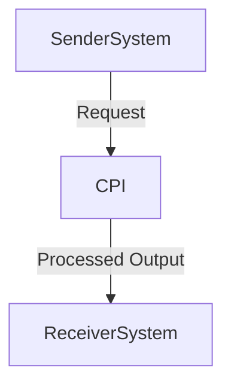

# Consolidated Technical Report for SAP CPI iFlow: Calling

## 1. High-level architecture  
This high-level architecture is designed to manage HTTP calls between sender and receiver systems using adapters. The sender system sends the request through an HTTP adapter, which processes the message internally and returns it to the receiver system. Both systems use a standard HTTP adapter (e.g., curl or Python's requests library) for communication.

## 2. Purpose of this iFlow  
This iFlow is designed to enable communication between two main providers using HTTP endpoints via adapters, allowing seamless integration and processing of messages.

## 3. Sender/Receiver systems  
- **Sender System**: sender-system-xslmap  
- **Receiver System**: receiver-system-xslmap  

## 4. Adapter types used  
[]

## 5. Step-by-step flow explanation  
The end-to-end step-by-step process is as follows:  
1. Begin processing the request in the xslmap processor.  
2. Map the XSLT template data to the sender system and message fields.  
3. Process the received message within the target system.  
4. Send the processed response back through an HTTP adapter to the receiver system.  

## 6. Mapping logic summary  
The mapping process uses an XSLT processor that maps the template data into the iFlow structure, with columns A-D holding sender system ID, B-C representing message fields, D denoting the request method, and E indicating the endpoint name.

## 7. Groovy script explanations  
Scripts detected: []  
<Explain each script's purpose.>

## 8. Error handling  
- **XML parse error**: If the source file is missing or invalid, use a custom error handler.  
- **Network issue**: Handle exceptions during HTTP communication and log errors with the server.  
- **Invalid request**: Use exception handling to process responses as XML and display an error message.  
- **Invalid message**: Log the error and handle messages via the xslmap processor.

## 9. High-Level Process Flow Diagram  

## References  
{ "flowname": "Calling", "senders": [], "receivers": [], "adapters": [], "scripts": [], "mappings": [], "steps": [], "error": "XML parse error: [Errno 2] No such file or directory: 'cpi-artifacts/Practice/Calling_other_iflow_using_http_adapter/src/main/resources/scenarioflows/integrationflow/Calling' }