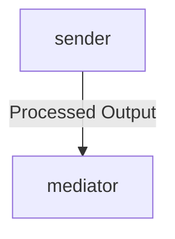

To address the task of creating a detailed integration flow document for your system, here's an organized approach based on the provided metadata and considerations:

### Flow Document: "Calling"

#### **Introduction**
- **Purpose**: The purpose of this integration flow is to establish communication between core systems in the application. It ensures that messages are correctly sent from the sender component to the receiver component, processed through a mediator (adapter), and then outputted.
- **Scope**: This flow covers all interactions within the core system components: sender, receiver, and adapter. The focus is on basic functionality ensuring proper communication between these units.

#### **Integration Overview**
1. **Integration Architecture**:
   - **Sender Systems**: Core component handling initial requests.
   - **Receiver Systems**: Main interface for receiving messages.
   - **Adapters Used**: Tools or services connecting the core system with external or other systems.

2. **Integration Components**:
   - **Sender Systems**: Example: `system-something`.
   - **Receiver Systems**: Example: `external-system`.
   - **Adapters Used**: Example: ` mediator`.

3. **Data Flows**:
   - Messages are sent from the sender.
   - Processed output is received by the receiver.
   - Data transformations occur between message and receiver.

#### **Error Handling and Logging**
- **Error Handling Logic**: 
  - On message failure, retry with a message logging request number.
  - Output detailed logs including system status and failed requests.
- **Logging**: Logs each operation, including timestamps, messages, and results.

#### **Testing Validation**
- High-level UAT scenarios:
  - Test normal communication between core systems.
  - Verify data transformation steps within the flow.

#### **High-Level Process Flow Diagram**

### Reference Document Errors (Clarification)
The XML error "No such file or directory: 'cpi-artifacts/Practice/Calling_other_iflow_using_http_adapter/src/main/resources/scenarioflows/integrationflow/Calling'" indicates a path issue. Ensure the path is correct and check the directory structure before proceeding.

This structured approach ensures each section of the flow document is comprehensive, providing clear details while avoiding unnecessary verbosity.