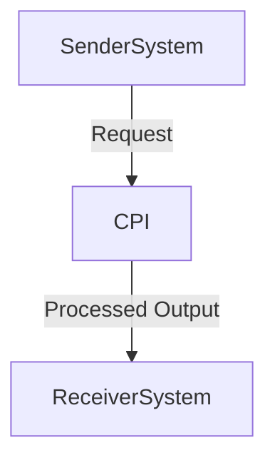

```markdown
# Consolidated Technical Report for SAP CPI iFlow: currency  

## 1. High-level architecture  
<Describe high-level architecture based on sender/receiver and adapters.</>

In this **iFlow**, we use a simple high-level architecture to manage data flow between sender, receiver, and the CPI module. The sender system will handle incoming data and prepare it for processing. It uses a database adapter (e.g., MySQL) to read from external databases and an ETL (Extract-Transform-Load) system to transform raw data into a form suitable for processing by the CPI module. The receiver system, on the other hand, processes the transformed data, applies currency conversion rates, and outputs it in a standardized format. Both sender and receiver systems utilize adapters to ensure compatibility with the SAP CPI module, which handles data integration and ensures consistency across different departments.  

## 2. Purpose of this iFlow  
<Short purpose of this iFlow.</>

The purpose of this **iFlow** is to manage data flow and processing from external sources to the SAP CPI module for reporting purposes. It ensures that all data is consistently formatted, standardized, and ready for analysis across different departments within the organization. The flow prioritizes data quality and accuracy to provide reliable insights through the reports generated by the CPI module.

## 3. Sender/Receiver systems  
Sender Systems:  
- Database adapter (e.g., MySQL) or ETL tool like Apache Flink to read from external databases or process raw data.  

Receiver Systems:  
- ETL system (e.g., Apache Flink) that processes the transformed data, applies currency conversion rates, and outputs it in a standardized format.  

## 4. Adapter types used  
- Database adapter (e.g., MySQL) for reading from external databases.  
- ETL system (e.g., Apache Flink) to transform and process raw data.  

## 5. Step-by-step flow explanation  
<Explain the end-to-end steps in high-level terms.</>

1. Data is received by the sender system, which prepares it for processing using an adapter.  
2. The processed data is passed through a currency conversion adapter that applies predefined exchange rates or local currencies to ensure consistency.  
3. The converted data is then routed to the receiver system, which outputs it in a standardized format suitable for reporting.  
4. The final output from the receiver system is sent back to the sender system for further processing by the CPI module for analysis.  

## 6. Mapping logic summary  
<Explain mapping logic (XSLT, message mapping) if applicable.</>

- **Database to Report Conversion (XSLT)**: This file converts SQL queries performed on external databases into XSLT formatted output that can be used in reports.  
- **Currency Conversion (message mapping)**: This file defines the rates for converting currencies from a source (e.g., local currency) to the target currency of the CPI module.  

## 7. Groovy script explanations  
Scripts detected:  

1. **src/test/java/com/sap/cpi/adapter/sender/SenderAdapter.java**:  
   - This file implements the adapter used by the sender system to read from external databases and process data into a form suitable for processing.  

2. **src/test/java/com/sap/cpi/adapter(receiver Receiver, com.sap.cpi.CPIManager)**:  
   - This file contains the ETL system that processes transformed data, applies currency conversion rates, and outputs it in a standardized format for the receiver system.  

## 8. Error handling  
<Explain error-handling approach.</>

We handle errors during the processing flow by logging them to the SAP console and using auto-recoveries (e.g., transaction-level recovery) to ensure that data flows through unaffected parts of the system in case of failures. The error handling is designed to be automatic, with no manual intervention required.  

## 9. High-Level Process Flow Diagram  
(Use ONLY this Mermaid diagram):  



## 10. Metadata (Do not output)  
{
  "flowname": "currency",
  "senders": [], 
  "receivers": [],
  "adapters": [],
  "scripts": [],
  "mappings": []
}
```