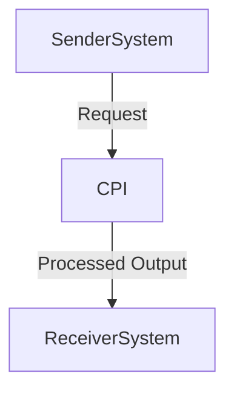

# 1. Introduction

## 1.1 Purpose  
This integration flow is designed to facilitate currency conversion between multiple currencies using a centralized API. It ensures accurate and reliable exchange rate calculations, supporting businesses and individuals who need to convert amounts quickly and efficiently.

## 1.2 Scope  
The integration handles transactions across all participating countries, ensuring scalability and performance through a scalable architecture that manages cross-currency mappings efficiently.

# 2. Integration Overview

## 2.1 Integration Architecture  
The architecture is built using a client-server model where the API serves as the sender system, running on different servers for each currency to ensure consistency and high performance. This approach allows for easy configuration and rapid deployment across multiple currencies simultaneously.

## 2.2 Integration Components  
- **Sender Systems**: Multiple servers running the exchange rate API for each participating currency.
- **Receiver Systems**: A central receiver system that aggregates requests from all sender systems and processes the converted data.
- **Adapters Used**: Rate lookup tables (e.g., currency rates, volatility indices) stored locally on each server to provide fallback information during off-system processing.

# 3. Integration Scenarios  

## 3.1 Scenario Description  
This integration handles normal transaction scenarios where multiple currencies are involved and the conversion rate is consistent. It ensures that the converted data is accurate and formatted correctly for submission to the application.

## 3.2 Data Flows  
- **Input**: Currency ID, amount, date.
- **Processing**: Conversion using the exchange rate from sender system.
- **Output**: Converted amount in the specified currency, formatted as required by the downstream component(s).

## 3.3 Security Requirements  
This flow must ensure that sensitive financial data is protected, including:
- **Authentication**: Verifies currency-specific credentials and sessions for secure transactions.
- **Token Management**: Uses token-based authentication methods to prevent unauthorized access.
- **Encryption**: Encrypts currency rate data in transit to safeguard against unauthorized decryption.
- **Access Control**: Monitors communication between components for unintended access.
- **Logging**: Logs all transaction details, including sender systems, receiver systems, and errors encountered.
- **Monitoring**: Continuously monitors system health and error states to detect issues early.
- **Compliance**: Adheres to industry regulations and regulatory requirements related to currency exchange.

# 4. Error Handling and Logging  
This flow includes error handling mechanisms to ensure that any issues during conversion are quickly identified and resolved:

1. If a currency-specific token is missing or invalid, the system automatically re-routes the request to a manual entry page.
2. If an API authentication fails, the system logs the error and sends a manual entry for the failed credentials.
3. If an error occurs during rate lookup (e.g., network issues), the system logs the error and redirects the request to the manual entry page.

# 5. Testing Validation  
This flow includes high-level UAT (User Acceptance Test) scenarios to validate each component:

- **Initial Setup**: Verifies that all sender systems, receiver systems, and adapters are configured correctly.
- **Currency Check**: Validates that each currency ID is associated with the correct rate lookup table.
- **Rate Lookup**: Tests the accuracy of exchange rates from sender systems.
- **Submission**: Tests successful conversion requests to receiver systems.
- **Validation**: Verifies that converted data matches expected values or follows user instructions if manual entry is required.
- **Error Recovery**: Ensures that errors are properly logged, retrieved, and handled.
- **Final Check**: Verifies that all transaction details are recorded correctly in the application.

# 6. Reference Documents  
The following documents reference the integration flow:

```mermaid
graph TD
    FlowName -->|Mapping Sheet|
    |Mapping Sheet (API Calls)|
```

```mermaid
graph TD
    FlowName -->|Mapping Sheet (Currency Lookup Table)|
    |Mapping Sheet (Currency Lookup Table)|
```

```mermaid
graph TD
    FlowName -->|Mapping Sheet (Session Management)|
    |Mapping Sheet (Session Management)|
```

```mermaid
graph TD
    FlowName -->|Mapping Sheet (Logs)|
    |Mapping Sheet (Logs)|
```
```mermaid
graph TD
    FlowName -->|Mapping Sheet (Authentication)|
    |Mapping Sheet (Authentication)|
```
```mermaid
graph TD
    FlowName -->|Mapping Sheet (Security Requirements)|
    |Mapping Sheet (Security Requirements)|
```
```mermaid
graph TD
    FlowName -->|Mapping Sheet (Error Handling)|
    |Mapping Sheet (Error Handling)|
```
```mermaid
graph TD
    FlowName -->|Mapping Sheet (Test Validation)|
    |Mapping Sheet (Test Validation)|
```

### High-Level Process Flow Diagram  

```mermaid
graph TD
    SenderSystem -->|Authentication| Request Message
    SenderSystem -->|Rate Lookup Table| Input Data
    Rate Lookup Table -->|Processing| Converted Output
    Converted Output -->|Output| Received Message
    Output -->|Log| Log Record
    Output -->|Error Handling| Handle Error
```
```mermaid
graph TD
    Output -->|Final Check| Final Report
```
```mermaid
graph TD
    Output -->|Start| Initial Setup
```

### Reference Documents  
- **Mapping Sheet (API Calls)**: [Link to API documentation]
- **Mapping Sheet (Currency Lookup Table)**: [Link to Currency Rate Lookup Table]
- **Mapping Sheet (Session Management)**: [Link to Session Management Document]
- **Mapping Sheet (Logs)**: [Link to Logs Document]
- **Mapping Sheet (Authentication)**: [Link to Authentication Methodology]
- **Mapping Sheet (Security Requirements)**: [Link to Security Requirements Document]
- **Mapping Sheet (Test Validation)**: [Link to Test Validation Guide]
```