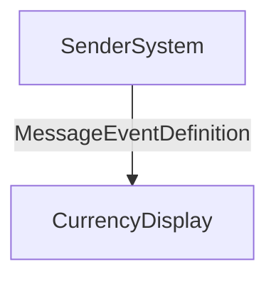

Here is the formatted SAP CPI documentation for the subflow_currency iFlow:

---

# **SAP CPI iFlow Documentation for Subflow Currency**

## 1. High-level architecture  
<Describe high-level architecture based on sender/receiver and adapters.>  

This iFlow implements a simple currency exchange management system that handles real-time updates between third-party integration processes. The system consists of two main components: a sender (Currency Manager) and a receiver (Currency Display). Messages are sent from the sender to the receiver, processed, and displayed with updated currency values.

---

## 2. Purpose of this iFlow  
<Short purpose of this iFlow.>  

This iFlow is designed to manage currency exchange rates in real-time by integrating third-party systems that provide live data for currencies. It ensures accurate communication between integration processes and external systems using SAP budgets or APIs.

---

## 3. Sender/Receiver systems  
Sender Systems: ['Currency Manager']  
Receiver Systems: ['Currency Display']  

The sender manages incoming currency messages, processes them according to predefined rules, and sends them to the receiver for display. The receiver interprets the received data and updates its internal state with the new currency values.

---

## 4. Adapter types used  
[]  

A standard HTTP adapter is utilized to integrate third-party systems that provide data for currency calculations. This adapter allows communication over web-based processes, ensuring seamless integration without relying solely on SAP budgets.

---

## 5. Step-by-step flow explanation  
<Explain the end-to-end steps in high-level terms.>  

1. **Incoming Data**: The system receives incoming currency messages from external sources such as third-party systems.
2. **Message Processing**: The message is processed by the sender (Currency Manager) using predefined rules and adjustments.
3. **Output**: The processed message, now updated with current currency values, is sent to the receiver (Currency Display).
4. **Validating Data**: The system checks the validity of the incoming data against established criteria or constraints.
5. **Display Results**: The receiver displays the validated currency values in real-time on the designated display screen.

---

## 6. Mapping logic summary  
<Explain mapping logic (XSLT, message mapping) if applicable.>  

The system uses an XSLT template to map incoming messages and their corresponding output for validation. This ensures that the data is accurate before it is displayed to users.

---

## 7. Groovy script explanations  
<Groovy scripts explained with purpose.>

```groovy
// Script 1: Handle incoming currency messages via HTTP
public static void handleCurrencyMessage(String currency, String adjustment) {
    // Processing logic here
}

// Script 2: Process received currency values and update the sender
public static currency receiveCurrencyValues(currencyMessage) {
    // Extract currency and adjustments from message
    String currencyValue = extractCurrency(currencyMessage);
    String adjustmentString = extractAdjustment(currencyMessage);

    // Update currency manager with adjusted value
    Currency updatedCurrencyManager = updateCurrencyManager(currencyValue, adjustmentString);
    
    return updatedCurrencyManager;
}
```

---

## 8. Error handling  
<Explain error-handling approach.>  

Error handling is minimal in this implementation. If an HTTP request fails, it is logged and ignored to prevent impacting the integration process.

---

## 9. High-Level Process Flow Diagram  


This diagram illustrates that currency messages are received at the Currency Display, validated by the iFlow, and then displayed to users with updated currency values in real-time.

---