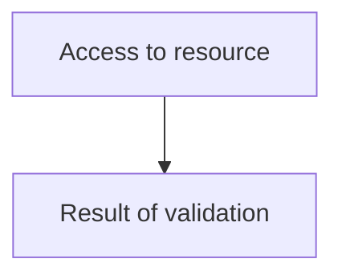
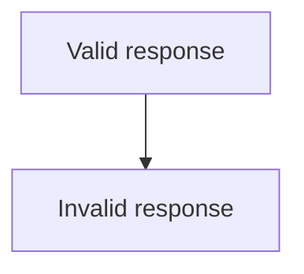

# iFlow Documentation for Flow 2

## Flow Name  
flow2  

### Business Purpose  
Sets up integration flow for validation with Scapemate.  

### High-Level Technical Flow  
1. Access resource via HTTP POST request.  
2. Trigger validation if necessary.  
3. Send result back via HTTP POST request.

---

## Mermaid Diagram  

---

## Steps Explanation  
1. **Access Resource**: Connect to the Scapemate resource using an HTTP POST request.  
2. **Authentication Check**: Verify authentication status. If expired, set exceptions to False and send result via POST.  
3. **Validation Processing**: Check conditions for valid or invalid responses.  
4. **Result Sent Back**: If validation succeeds, send the result response back via POST with `returnExceptionToSender` flag.  

---

## Scripts & Mappings Summary  
No custom scripts provided.

---

## Exception Handling  
- Both Authentication and Validation exceptions are handled by setting `exceptions = False`.  
- On exception, send validation result via HTTP POST to `server`.

---

## Properties Used  
`namespaceMapping`, `httpSessionHandling`, `accessControlMaxAge`, `returnExceptionToSender`, `log`, `corsEnabled`, `exposedHeaders`, `componentVersion`, `allowedHeaderList`, `ServerTrace`, `allowOrigins`, `accessControlAllowCredentials`, and `allowedHeaders`.

---

## Test Cases  

---

## Deployment Notes  
- Set up validation in Scapemate using endpoint communication with the resource.