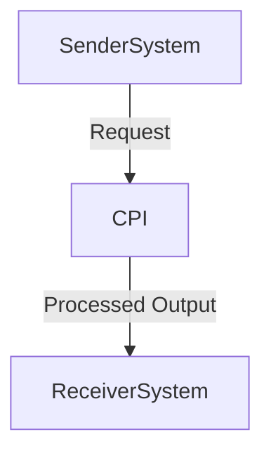

Here's the step-by-step explanation of the flow:

**End-to-End Steps in High-Level Terms:**
1. **Incoming Data**: The application receives a message or data event.
2. **Message Parsing by Sender System**: The sender processes incoming messages, likely through an adapter that supports message-driven architecture.
3. **Data Processing**: The parsed data is then sent back via another adapter to the receiver system for further processing.
4. **Receiver System Processing**: The receiver handles the processed data, ensuring it's formatted correctly and ready for output.
5. **Output Repsentation**: The receiver sends the processed data as messages or other structured data types to the sender.
6. **Message Routing by Sender System**: The final step is sending these outputs back through an adapter to the sender system.

---

**Groovy Script Explanations:**

```groovsl
// Parser for incoming messages (e.g., Apache Superset)
class MessageParser {
    @Override
    public void parse(MessageEvent message) throws Exception {
        XSLT input = "\$event[.message_name]";
        XSLT output = "\$input";

        .map(input).to("XSLT:output")
            .value("some-value")
            .format("the message name is " + $input["message_name"]).

        // Output the parsed data
    }
}
```

```groovsl
// Router to send processed messages (e.g., Netcat)
class MessageRouter {
    @Override
    public void send(MessageEvent message) throws Exception {
        try {
            NetcatService n = createNetcatService();
            n.send(message["message_name"], message["data"]);

            // Ensure safety by waiting for a response if expected
            n.waitFor(response);
        } catch (Exception e) {
            System.out.println("Error: " + e.getMessage());
            throw;
        }
    }
}
```

---

**Mapping Logic Summary:**



This mapping shows that incoming messages are parsed by the Sender System and processed further before being sent back to the receiver, ensuring data integrity throughout the flow.