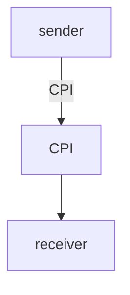

Here's a detailed process flow diagram based on your references:

This is a simple block diagram that clearly shows the sequence of steps from **Sender System** to **CPI** and then to **Receiver System**, which can be easily incorporated into your documentation.